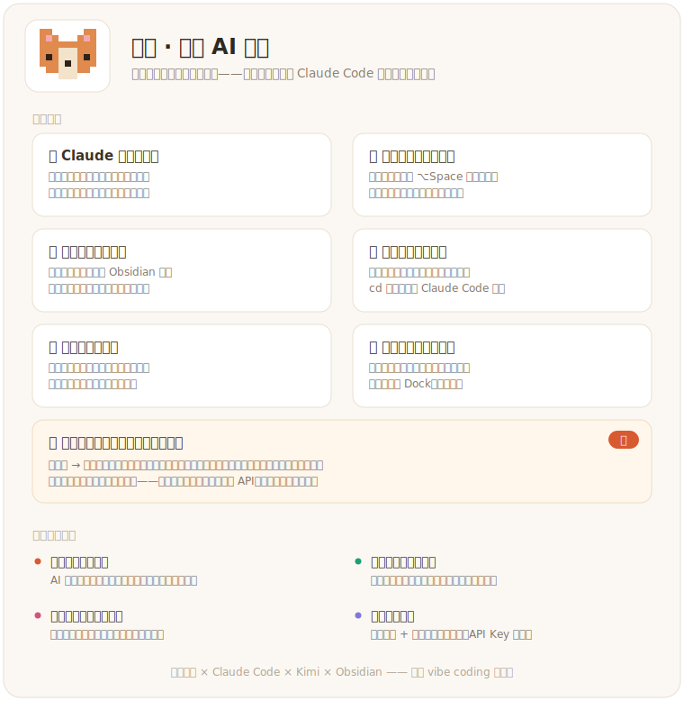

# 🦛 河马 Hema — macOS 桌面宠物

一只住在 Mac 桌面角落的像素河马：安静呼吸、在家附近溜达又**自己走回原位**、可随手拖动。它同时是一个开发工作流的状态指示器——**接入 Claude Code 实时显示任务状态**（头顶一枚白色对话气泡）、**把文件/文件夹拖给它一键在终端拉起 Claude Code**，还能**双击和它聊天**（任意 OpenAI 兼容模型驱动）、**语音问答**、**喊「河马河马」离线唤醒**，以及在你忙碌的间隙**主动冒泡关心你**。

<p align="center">
  
</p>

桌面萌宠与开发状态指示器缝在一起——既是陪伴，也是趁手的小工具。不填任何配置就能玩（休息、走动、拖动、Claude 状态、主动互动）；只有聊天 / 语音 / 笔记问答需要你自己的 API Key。

## 核心功能

| 能力 | 说明 |
| --- | --- |
| 😌 **安静休息 + 呼吸** | 大部分时间正面安静待机，带轻微呼吸起伏与偶尔眨眼，存在感低但有温度 |
| 🦛 **小动作 & 家附近溜达** | 休息一阵后做 1–2 个动作（挥手 / 抱臂 / 打滚 / 散步）。散步**只横着走**，在「家」左右约 240px 内选目标，走完**先走回家**再趴下，绝不越走越远。拖动它＝搬家，落点即新家 |
| 🖱️ **拖动 & 轻点** | 按住身体 1:1 跟手拖到任意位置；轻点一下它会回应你 |
| 💬 **和河马聊天** | **双击河马身**或右键 → 聊天，弹出贴在它头顶的浅色聊天卡片，打开即可直接打字。河马人设、中文短句、活泼可爱；历史在会话内保留 |
| 🎤 **语音输入** | 聊天卡片里按一下麦克风开始说话、再按一下结束：本地转 16kHz WAV → 音频模型逐字转写（带「河马」热词）→ 文本自动作为消息发出 |
| ⌨️ **全局长按说话（⌥Space）** | 在**任何应用里**按住 `Option+Space` 即弹出聊天窗开始录音，松手自动转写发送。快捷键可在设置 / `config.json` 改 |
| 🎙 **喊「河马河马」免按键唤醒** | 麦克风**本地离线**监听唤醒词，喊一声即弹出聊天窗聆听，说完停顿自动转写发送。识别全程在本机完成，**不联网、不耗 API、不上传音频**，可随时开关 |
| 💗 **主动互动** | 河马时不时在头顶冒一个白色对话气泡关心你——久坐提醒 / 关心陪伴 / 卖萌唠嗑 / 按时段问候，配一声很轻的「叮」。默认每 25–45 分钟一次，频率与开关可在设置面板调 |
| 📓 **用你的 Obsidian 笔记回答** | 填上库路径后，每次提问会**本地检索**你的笔记（中文双字匹配 + 标题加权），把最相关的几段作为参考来回答，并自然提到出自哪篇 |
| 🤖 **Claude Code 状态气泡（全机监听）** | 头顶一枚自适应宽度的白色对话气泡：**自绘小指示器** + **任务名**。只显示真实知道的事——🔵 旋转圈＝在跑 / 🟡 琥珀脉冲＝等你确认 / ✅ 绿勾＝完成（配系统通知）。监听**这台机器上所有项目**的 Claude Code 会话，多任务并行时显示最新任务 + `＋N` 后缀，每完成一个闪一次 ✅ |
| 📂 **拖文件起终端** | 把 Finder 的文件/文件夹拖到它身上：悬停亮出 📂 邀你松手，落下后河马张嘴把它吃进去，同时打开 Terminal、`cd` 过去并运行 `claude`；拖文件时还会把 `@文件名` 预填进输入框 |
| ⚙️ **图形设置面板** | 右键 → 设置（没填 Key 时双击/唤醒也会直接弹）：填 API Key、从主流模型下拉里选模型（或自定义）、写自定义人设、设 Obsidian 库、开关语音唤醒与主动互动、一键测试连接。改完即时生效，无需手改 JSON |
| 🫥 **像素级点击穿透** | 只有身体不透明像素能被点中，透明区域的点击直接穿透到下面的应用 |
| 📌 **悬浮于一切之上** | `screen-saver` 窗口层级 + 跨空间可见，普通应用、浮动面板、全屏 app 都压不住它 |

## 工作原理

- **Claude 状态联动**：主进程在 `127.0.0.1:4319` 起一个本地 HTTP 监听；`~/.claude/settings.json`（全局）与本项目 `.claude/settings.json` 里的 hooks 用 `curl` 把 `UserPromptSubmit / PostToolUse / Notification / Stop / SessionEnd` 事件转发过来（桌宠没开时 `curl` 秒失败，完全不影响 Claude Code）。状态**按 session 跟踪**后合并展示，两份 hooks 并存时按（事件, 会话）600ms 去重。注意 hooks 在会话启动时加载，**已经开着的 Claude 会话需重启才会被监听**。
- **状态气泡**：白底圆角气泡 + 向下尾巴，宽度随任务名自适应；指示器（旋转圈 / 脉冲点 / 对勾）全部用 Canvas 路径**手绘**，几个像素也保持锐利。Claude Code 没有真实「百分比」，所以气泡只声称它真正知道的事——还在跑 / 等确认 / 跑完，不画估算进度条。
- **主动互动**：渲染层维护一个随机定时器，到点从四类文案库里挑一句，在头顶用同一套气泡（粉色爱心指示器）显示约 6 秒后淡出，并用 Web Audio 合成一声很轻的「叮」。屏幕休眠、拖拽、或正有 Claude 任务气泡时本轮自动跳过，不打断你。
- **拖文件起终端（影子接驳窗）**：两条 macOS 实测规则决定了实现——① 配置过点击穿透的窗口**永远收不到拖拽事件**；② 拖拽期间系统**不派发鼠标事件**。所以用一个微型 python 子进程（pyobjc）盯住系统拖拽剪贴板 + 鼠标键状态：发现你在拖文件时，立刻在河马位置显示一个隐形、**从未穿透过**的「接驳窗」接住悬停与投放并转发给河马，松手即隐藏——像素级穿透零损失。落下后通过 `osascript` 驱动 AppleScript 打开 Terminal 执行命令。该功能需要系统有 `python3` + `pyobjc`（缺了只影响拖放，不影响其它功能）。
- **聊天**：请求在**主进程**完成（API Key 永不进渲染层）；Key / 模型 / 接口地址放在 gitignore 掉的本地 `config.json`（模板见 `config.example.json`），每次发送时现读，填好即刻生效。河马人设通过 system prompt 注入。任何 OpenAI 兼容接口均可，默认走 OpenRouter，模型可在设置面板的下拉里切换。
- **Obsidian 检索**：轻量本地 RAG——把问题切成中文双字组合 + 英文词，扫描库内全部 `.md`（跳过 `.obsidian` / Excalidraw，单文件 ≤200KB，上限 4000 篇），按命中数打分（标题命中 ×4 加权），取最相关 4 篇、每篇截取命中处约 420 字作为参考随问题发出。五百篇规模检索 <1 秒，全程不联网（除发给模型那一步）。
- **语音输入**：渲染层 `MediaRecorder` 录 webm/opus → `decodeAudioData` + `OfflineAudioContext` 重采样为 16kHz 单声道 → 手写 WAV 编码 → base64 交主进程 → 以 `input_audio` 调音频模型（默认 `google/gemini-2.5-flash`）逐字转写 → 文本走正常聊天链路。单次录音上限 1 分钟。
- **全局长按说话**：Electron 全局快捷键只有「按下」没有「松开」，所以按下由 `globalShortcut` 触发（弹窗并开录），松手由获得焦点的聊天窗监听 keyup 结束；兜底：再按一次快捷键、点 ■、或 60 秒上限。聊天窗预创建（隐藏）保证弹出零等待。
- **语音唤醒**：一个隐藏的「监听窗」用 Web Audio 采麦克风、降到 16kHz 单声道串流给主进程；主进程用 **sherpa-onnx**（`sherpa-onnx-node` + WenetSpeech 中文 KWS 模型，约 5.5MB，放在 `assets/kws/`）做离线关键词检测——纯本地、无网络、无 API。命中后弹窗进入语音活动检测（VAD）录音：检测到你开口、再检测到约 1.2 秒静音就自动停并转写发送。缺原生模块或模型文件时自动降级为「无唤醒」，不影响其它功能。

## 技术栈

- **Electron**：透明 / 无边框 / 永远置顶 / 像素级点击穿透的桌面浮层窗口
- **原生 Canvas 2D**：逐帧像素动画 + 状态气泡手绘（命中检测与所见一致）
- **Node 内置 `http`** 实现 Claude Code hook 本地监听；**`osascript` / AppleScript** 驱动 Terminal
- **sherpa-onnx** 离线关键词检测；**Web Audio** 录音与重采样
- 安全模型：`contextIsolation` 开、`nodeIntegration` 关，渲染进程经各自 `preload.js` 白名单 IPC 与主进程通信

## 如何运行

> **环境要求**：macOS（Apple Silicon 或 Intel 均可）+ [Node.js](https://nodejs.org) 18 及以上。

### 拿到代码

```bash
git clone https://github.com/realruian/desktop-pet.git
cd desktop-pet
npm install        # 装依赖（Electron + 离线唤醒引擎，按芯片自动拉对应版本）
```

### 打包成独立 App（推荐）

```bash
npm run pack                              # 按当前芯片打包出 dist/河马-darwin-*/河马.app
cp -R dist/河马-darwin-*/河马.app /Applications/
```

之后**双击「河马」即可启动**；首次启动会自动注册**开机自启**（右键 → 取消勾选「开机自启」可关闭）。App 不占 Dock、不进 ⌘Tab（LSUIElement），同时只会运行一个实例。

> 🔓 **首次打开提示「无法验证开发者」**：这是本地自己打的包、没做苹果签名。**右键河马 →「打开」→ 再点「打开」** 即可（只需一次）。

### 开发调试

```bash
npm start        # 直接跑源码（等价于 electron .）
```

启动后河马出现在主屏**右下角**。退出：**右键 → 退出**。

## 配置

所有配置都能在**右键 → 设置**的图形面板里完成（推荐），改完即时生效；也可手改 `~/Library/Application Support/hema-desktop-pet/config.json`（模板见 `config.example.json`，开发版与打包版读同一份）。

- **聊天**：填入 API Key——[OpenRouter](https://openrouter.ai)（`sk-or-` 开头）或 [Moonshot 直连](https://platform.moonshot.cn) 均可——再从下拉里选一个模型。
- **笔记问答**：在设置里填 Obsidian 库路径即可启用本地检索。
- **语音唤醒 / 主动互动**：设置面板里有独立开关与频率/灵敏度调节，默认都开启。

> ⚠️ 首次用「拖文件起终端」会弹两个 macOS 权限，各点一次「允许」即可：
> 1. **自动化**：允许河马（开发版显示为 Electron）控制 Terminal——打开终端需要；没点的话 AppleEvent 会一直等到超时，看起来像「拖了没反应」。
> 2. **辅助功能**：仅用于把 `@文件名` 预填进输入框（不给也能打开终端，只是不预填）。

桌宠默认监听**全机所有项目**的 Claude Code（hooks 已注册到 `~/.claude/settings.json`；本项目的 `.claude/settings.json` 留有同样一份供克隆者开箱即用）。

## 目录结构

```
main.js                 主进程：透明窗口 / IPC / 右键菜单 / 光标轮询 / Claude hook 监听 / 拖文件起终端 / 聊天 / 语音唤醒 / 设置
kws.js                  语音唤醒引擎（封装 sherpa-onnx KeywordSpotter）
preload*.js             各窗口的安全 IPC 桥（pet / chat / settings / catcher / listener）
build/                  打包资源：icon.icns、extend.plist（权限声明）、make-icon.py、pack.js
renderer/
  index.html / style.css   铺满窗口的单个 <canvas>，透明像素渲染
  pet.js                   动画引擎 + 行为状态机 + 拖动/穿透 + Claude 状态气泡 + 主动互动 + 拖放
  chat.html/css/js         聊天面板（浅色气泡列表 + 输入框 + 语音/VAD）
  settings.html/css/js     图形设置面板
  catcher.html/js          隐形拖放接驳窗
  listener.html/js         隐形语音监听窗（采麦克风 → 16k PCM 串流给主进程）
config.example.json     配置模板（复制为 config.json 填 Key；config.json 不入库）
assets/{walk,scratch,wave,roll,cheer,eyes,expressions}/   归一化动画帧
assets/kws/             离线语音唤醒模型（WenetSpeech 中文 KWS，约 5.5MB）
.claude/settings.json   把 Claude Code hooks 转发给桌宠
SPEC.md / SPEC2.md      完整实现规格
```

完整设计见 [SPEC.md](SPEC.md) 与 [SPEC2.md](SPEC2.md)。

## License

MIT
